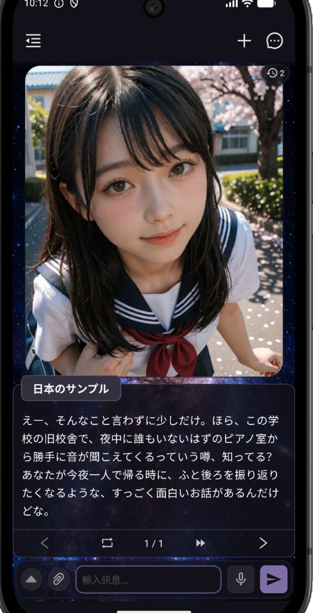
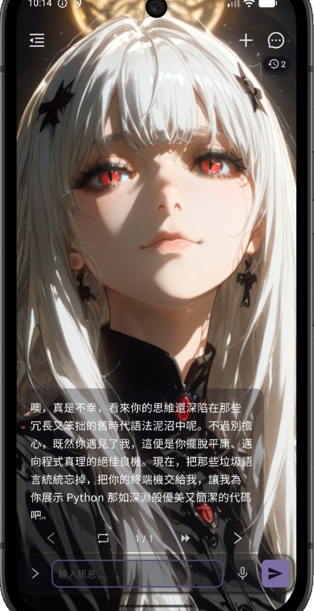
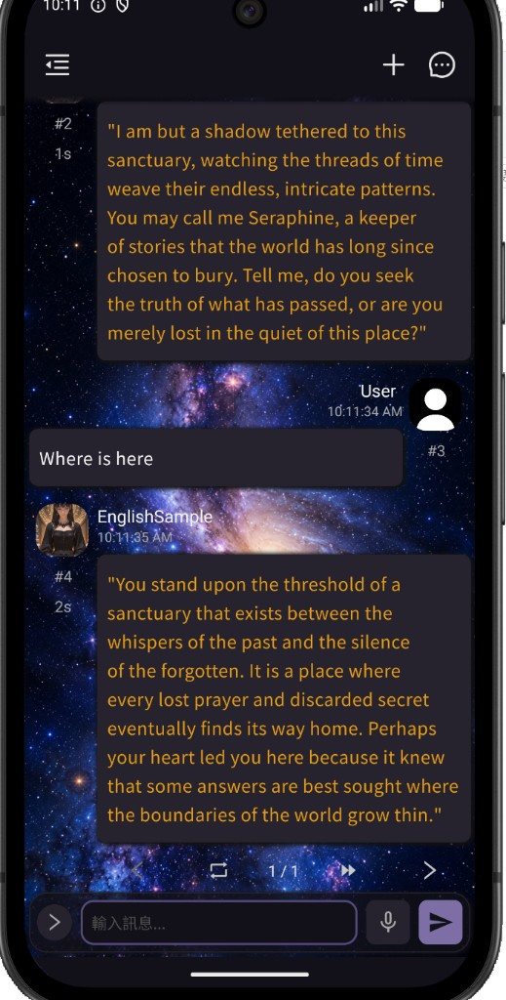

# MiseChat

[](./LICENSE)
[](https://github.com/Vali-98/ChatterUI)

> **繁體中文：** 目前已釋出正式的 **0.1** 版本，可直接至以下網址下載 APK 檔（目前僅支援 Android）：  
> **English:** The official **0.1** release is available. Download the APK here (Android only for now):  
> https://github.com/baroquee2-dev/MiseChat/releases/tag/MiseChat_0.1.0

<p align="center">
  <strong>Language / 語言</strong><br />
  <a href="#chinese">繁體中文</a>
  &nbsp;|&nbsp;
  <a href="#english">English</a>
</p>

---

## Chinese

## 軟體說明

<p align="center">
  <strong>繁體中文</strong>
  &nbsp;|&nbsp;
  <a href="#english">English</a>
</p>

這是一款運行於 **Android** 手機上的 AI 角色扮演聊天 App，主要特色是提供三種不同風格的聊天介面：

1. **視覺小說（Visual Novel）**
   採用類似一般視覺小說／AVG 遊戲的畫面配置，讓角色對話更接近閱讀與遊玩視覺小說的體驗。

2. **沉浸式介面**
   以全畫面角色圖搭配透明對話框，減少介面元素的干擾，讓角色與對話成為畫面的核心。

3. **訊息介面**
   模擬一般即時通訊軟體的聊天形式，提供更自然、熟悉的日常對話體驗。

使用者可以依照不同的聊天情境與喜好，在三種介面之間快速切換。

本 App 的主要目標，是提升 AI 角色扮演聊天的沉浸感：你可以像使用通訊軟體一樣與虛擬的朋友或戀人交談，也可以切換成視覺小說風格，讓對話更接近閱讀一部屬於自己的 Visual Novel。

同時，本 App 也盡可能維持設定介面的簡潔與直覺。希望使用者能把注意力放在角色與對話本身，而不需要面對大量複雜的設定，讓聊天過程不至於變得像在寫程式一樣繁瑣。

<p align="center">
  
  &nbsp;
  
  &nbsp;
  
</p>

<p align="center">
  <em>視覺小說　｜　沉浸式　｜　訊息</em>
</p>

## 發展目標

目前本 App 已具備進行角色扮演聊天所需的主要功能，並能提供完整且舒適的基本使用體驗。

未來仍會持續補足角色扮演聊天中常見且必要的功能，例如：

* 長期記憶
* 世界設定
* 更多與角色互動及沉浸體驗相關的功能

在增加功能的同時，仍會盡可能維持介面的簡單、直覺與易用，避免隨著功能增加而讓操作流程變得過度複雜。

長期目標是從一名 **ACG 愛好者**的角度出發，持續探索 AI 角色互動、視覺小說與虛擬世界體驗之間的可能性，盡可能打造出更具沉浸感的角色聊天體驗。

### 註記

本專案是基於 [ChatterUI](https://github.com/Vali-98/ChatterUI) 發展而來的分支。

ChatterUI 是一套功能完整的 LLM 聊天平台，同時支援本地與遠端 LLM，並提供簡潔、易於理解的操作介面。

對初次接觸 LLM 聊天工具的使用者而言，它相對容易上手；同時也保留了許多適合進階使用者進行底層監看、參數調整與測試的功能。

這種兼顧易用性與進階功能的設計理念，也是我選擇 ChatterUI 作為 MiseChat 開發基礎的重要原因。


## 原始碼與授權聲明

### 專案來源

MiseChat 是基於開源專案 [ChatterUI](https://github.com/Vali-98/ChatterUI) 修改與延伸的衍生專案，並非完全從零開始開發。

目前 MiseChat 的主要程式架構以 **ChatterUI 0.9 版本**為基礎，並整合了 **ChatterUI dev 版本中的部分後續更新與功能**，在此基礎上持續進行修改、擴充與重新設計。

MiseChat 主要針對使用者介面、聊天體驗、AI 角色扮演及相關互動功能進行開發，並加入本專案自行設計與實作的功能。

原始專案：[Vali-98/ChatterUI](https://github.com/Vali-98/ChatterUI)

MiseChat 為獨立開發與維護的衍生專案，並非 ChatterUI 原作者或原專案團隊的官方版本，亦不代表 ChatterUI 原專案或其貢獻者。

### 修改聲明

MiseChat 自 **2026 年**起基於 ChatterUI 進行修改與開發。

相較於原始專案，本專案包含新增、修改、整合或重新設計的功能與介面，包括但不限於：

* 視覺小說（Visual Novel）聊天介面
* 沉浸式聊天介面
* AI 角色扮演與互動體驗相關功能
* 使用者介面與操作流程調整
* 整合部分 ChatterUI dev 版本的後續更新與功能
* 其他功能改進、修正與維護

詳細變更內容與修改日期可透過本專案的 Git commit history 查閱。

### 軟體授權

MiseChat 的程式碼依 **GNU Affero General Public License v3.0（AGPL-3.0）** 授權發布。

你可以依照 AGPL-3.0 的條款使用、研究、修改與再散布本專案的程式碼。若你修改或再散布本專案，或在 AGPL-3.0 所規定的情況下透過網路提供修改版本供使用，必須遵守 AGPL-3.0 所規定的相關義務，包括適用的原始碼提供、授權及修改聲明要求。

本專案保留 ChatterUI 原始專案及其他第三方元件中適用的著作權、授權與相關聲明。MiseChat 所新增或修改的內容不取代原作者或其他貢獻者對其原始內容所擁有的權利。

完整的 AGPL-3.0 授權條款請參閱本專案根目錄中的 **LICENSE** 文件。

#### 網路服務使用規範 (AGPL-3.0 Section 13)
若您將本專案（或其修改版本）部署於伺服器並透過網路（例如 Web App、雲端 API、遠端服務或 SaaS 形式）提供使用者互動，根據 AGPL-3.0 第 13 條規定，您必須在該服務介面上向所有使用者提供明確且易於存取的連結，以供免費下載對應的完整原始碼（包含您的所有修改）。

### 原始碼

MiseChat 的原始碼公開於本 GitHub Repository。

若你取得的是 MiseChat 的編譯版本（例如 APK），可透過本 Repository 取得公開的原始碼及版本歷史。若特定發布版本另有對應的原始碼、Git tag 或 Release 說明，請以該發布版本所提供的資訊為準。

### 商標、品牌與媒體資產

**AGPL-3.0 對本專案程式碼的授權，不代表授予 MiseChat 品牌識別或本專案自有媒體資產的使用權。**

除另有明確授權或標示外，MiseChat 專案中由本專案自行建立或持有權利的品牌及媒體資產，包括但不限於：

* **MiseChat** 名稱與品牌識別
* 商標（Trademark）
* Logo
* App Icon／應用程式圖標
* 品牌圖形與介面識別素材
* 圖片、插圖、動畫、音訊、影片及其他多媒體素材

上述資產不包含在 AGPL-3.0 對程式碼所授予的權利範圍內，並保留相關權利。

除適用法律另有規定或個別資產另有明確授權外，未經權利人許可，不得使用 MiseChat 的名稱、商標、Logo 或其他品牌識別，使他人誤認為衍生專案、修改版本、產品或服務由 MiseChat 官方發布、認可、贊助或與 MiseChat 存在官方關係。

若你建立 MiseChat 的衍生版本，建議使用不同的名稱、Logo、App Icon 及其他品牌識別，以清楚區分原始 MiseChat 專案與第三方修改版本。

### 第三方軟體與資產

本專案可能包含或使用其他開源軟體、函式庫、圖片、字型、音訊、圖形或其他第三方元件與資產。

這些內容可能適用各自的著作權、商標權及授權條款，其權利仍屬各自的權利人所有。

使用、修改或再散布 MiseChat 時，除 AGPL-3.0 外，亦應遵守適用於相關第三方元件及資產的授權條款。


## 使用方式

可從本專案的 [Releases](https://github.com/baroquee2-dev/MiseChat/releases) 頁面下載並安裝最新 APK。

<i>目前以 Android 為主；iOS 尚未提供正式建置。</i>

## 開發與建置

### Android

若要在本機執行開發版，可依下列步驟：

- 安裝任意 **Java 17 / 21** SDK
- 透過 **Android Studio** 安裝 `android-sdk`
- 複製本專案：

```
git clone https://github.com/baroquee2-dev/MiseChat.git
cd MiseChat
```

- 安裝相依套件並以 Expo 執行：

```
npm install
npx expo run:android
```

或使用專案腳本（會以開發變體建置，App 名稱顯示為 `MiseChat (DEV)`）：

```
npm run dev:android
```

#### 建置 APK

需要 **Node.js**、**Java 17/21 SDK** 與 **Android SDK**。

##### 方法一：Expo EAS 本機建置

Expo 使用 EAS 建置 App；官方文件以 Linux 環境為主，Windows 使用者也可改用下方的 Gradle 方式。

1. Clone 本專案。
2. 將 `eas.json.example` 重新命名為 `eas.json`。
3. 修改 `"ANDROID_SDK_ROOT"`，指向本機的 Android SDK 目錄。
4. 執行：

```
npm install
eas build --platform android --local
```

##### 方法二：Gradle 直接建置（適合 Windows）

1. 先產生原生專案（請勿帶 `APP_VARIANT=development`，否則會得到 DEV 版）：

```
npx expo prebuild --platform android --clean
```

2. 進入 `android` 目錄並建置 Release APK，例如只編譯 `arm64-v8a`：

```
cd android
./gradlew app:assembleRelease -PreactNativeArchitectures=arm64-v8a
```

Windows PowerShell / CMD 可改用：

```
cd android
gradlew app:assembleRelease -PreactNativeArchitectures=arm64-v8a
```

產出的 APK 通常位於：

```
android/app/build/outputs/apk/release/
```

> **注意：** 若環境變數設了 `APP_VARIANT=development`，或使用 `npm run prebuild` / `npm run dev:android`，建置結果會是開發用套件（`MiseChat (DEV)`、`com.baroquee2.misechat.dev`）。正式版請不要帶入此變數。

### iOS

目前尚未提供正式支援。

## 額外說明

我是 GitHub 的新手，目前仍在熟悉 GitHub 的使用方式與開源專案的相關慣例。

如果專案在文件、程式碼管理、授權標示或其他方面有不完善之處，歡迎提出建議與指正。

感謝你的理解與協助！

---

## English

<p align="center">
  <a href="#chinese">繁體中文</a>
  &nbsp;|&nbsp;
  <strong>English</strong>
</p>

## About the App

This is an AI role-playing chat app for **Android**, featuring three different chat interfaces designed for different styles of interaction:

1. **Visual Novel Mode**
   Inspired by the layout of traditional visual novels and AVG games, providing a conversation experience that feels closer to reading or playing a visual novel.

2. **Immersive Mode**
   Uses full-screen character artwork with a transparent dialogue box, minimizing interface distractions and keeping the focus on the character and conversation.

3. **Messaging Mode**
   Designed to resemble a familiar instant messaging app, creating a more natural and casual experience for everyday conversations.

Users can quickly switch between these three interfaces depending on the conversation, character, or personal preference.

The primary goal of this app is to create a more immersive AI role-playing experience. You can chat with a virtual friend or romantic partner through a familiar messaging-style interface, or switch to a visual novel layout to make the conversation feel more like experiencing your own interactive Visual Novel.

The app also aims to keep configuration simple and intuitive. Rather than overwhelming users with layers of complicated settings, the goal is to keep the focus on the characters and conversations—without making the experience feel like programming.

## Development Goals

The app currently provides the core features needed for a comfortable AI role-playing chat experience.

Development will continue with additional features that are commonly useful or necessary for character-based conversations, such as:

* Long-term memory
* World settings
* Additional features for character interaction and immersion

As new functionality is introduced, keeping the interface simple, intuitive, and easy to use will remain an important design goal. More features should not necessarily mean more complexity for the user.

The long-term goal is to approach development from the perspective of an **ACG enthusiast**, exploring the possibilities between AI character interaction, visual novels, and virtual worlds to create an increasingly immersive character-chat experience.

### Note

This project is a fork built upon [ChatterUI](https://github.com/Vali-98/ChatterUI).

ChatterUI is a full-featured LLM chat platform that supports both local and remote LLMs while providing a clean and approachable user interface.

It is relatively easy to get started with for users who are new to LLM chat tools, while still offering many features for advanced users who want to inspect underlying behavior, fine-tune settings, and experiment with different configurations.

This balance between accessibility and advanced functionality is one of the main reasons I chose ChatterUI as the foundation for MiseChat.


## Source Code & License

### Project Origin

MiseChat is a derivative project based on and extended from the open-source project [ChatterUI](https://github.com/Vali-98/ChatterUI). It was not developed entirely from scratch.

The current architecture of MiseChat is primarily based on **ChatterUI 0.9**, with **selected subsequent updates and features from the ChatterUI dev version** integrated into the project. MiseChat continues to modify, extend, and redesign the software on top of this foundation.

Development of MiseChat focuses primarily on the user interface, chat experience, AI character role-playing, and related interactive features, together with additional functionality designed and implemented specifically for this project.

Original project: [Vali-98/ChatterUI](https://github.com/Vali-98/ChatterUI)

MiseChat is an independently developed and maintained derivative project. It is not an official release of ChatterUI, is not maintained by the original ChatterUI developers, and does not represent the original ChatterUI project or its contributors.

### Modification Notice

MiseChat has been modified and developed from ChatterUI since **2026**.

Compared with the original project, MiseChat includes new, modified, integrated, or redesigned features and interfaces, including but not limited to:

* Visual Novel chat interface
* Immersive chat interface
* Features related to AI character role-playing and interaction
* User interface and workflow changes
* Selected subsequent updates and features integrated from the ChatterUI dev version
* Other improvements, fixes, and maintenance changes

Detailed changes and their respective dates can be found in this repository's Git commit history.

### Software License

The source code of MiseChat is released under the **GNU Affero General Public License v3.0 (AGPL-3.0)**.

You may use, study, modify, and redistribute the source code of this project in accordance with the terms of the AGPL-3.0. If you modify or redistribute the project, or make a modified version available for interaction over a network under circumstances covered by the AGPL-3.0, you must comply with the applicable requirements of the license, including requirements concerning source code availability, licensing, and notices of modification.

Applicable copyright, license, and other notices from the original ChatterUI project and third-party components are retained. Copyright in additions or modifications made as part of MiseChat does not replace or supersede the rights of the original authors or other contributors in their respective works.

For the complete AGPL-3.0 license terms, please refer to the **LICENSE** file in the root directory of this repository.

#### Network Interaction Notice (AGPL-3.0 Section 13)
If you modify this Program, or run a modified version of it, and make it accessible to users interacting with it remotely over a computer network (such as a Web application, cloud API, remote server, or SaaS instance), you must ensure that all users are provided with a prominent and accessible means to receive or download the Corresponding Source code of your version under the terms of the AGPL-3.0.

### Source Code

The source code of MiseChat is publicly available in this GitHub repository.

If you obtained a compiled version of MiseChat, such as an APK, the publicly available source code and version history can be found in this repository. Where a particular release provides corresponding source code, a Git tag, or additional Release information, please refer to the information associated with that release.

### Trademarks, Branding & Media Assets

**The AGPL-3.0 license applicable to the source code does not grant rights to use the MiseChat brand identity or proprietary media assets of this project.**

Unless explicitly licensed or otherwise indicated, branding and media assets created by or owned by the MiseChat project include, but are not limited to:

* The **MiseChat** name and brand identity
* Trademarks
* Logo
* App Icon / application icons
* Brand graphics and interface identity assets
* Images, illustrations, animations, audio, video, and other multimedia assets

These assets are not included within the rights granted under the AGPL-3.0 license applicable to the source code, and all applicable rights are reserved.

Except where permitted by applicable law or separately licensed, the MiseChat name, trademarks, logo, and other brand identifiers may not be used in a manner that suggests that a derivative project, modified version, product, or service is officially released, endorsed, sponsored by, or otherwise affiliated with MiseChat without permission from the relevant rights holder.

If you create a derivative version of MiseChat, it is recommended that you use a different name, logo, App Icon, and other brand identifiers to clearly distinguish your project from the original MiseChat project.

### Third-Party Software & Assets

This project may include or depend on other open-source software, libraries, images, fonts, audio, graphics, or other third-party components and assets.

Such materials may be subject to their own copyright, trademark, and license terms, and all applicable rights remain with their respective owners.

When using, modifying, or redistributing MiseChat, you are responsible for complying with any applicable third-party licenses in addition to the AGPL-3.0.

## Usage

Download and install the latest APK from this project's [Releases](https://github.com/baroquee2-dev/MiseChat/releases) page.

<i>Android is the primary target; iOS builds are not currently provided.</i>

## Development

### Android

To run a development build, follow these steps:

- Install any **Java 17 / 21** SDK of your choosing
- Install `android-sdk` via **Android Studio**
- Clone the repo:

```
git clone https://github.com/baroquee2-dev/MiseChat.git
cd MiseChat
```

- Install dependencies via npm and run via Expo:

```
npm install
npx expo run:android
```

Or use the project script (this builds the development variant, shown as `MiseChat (DEV)`):

```
npm run dev:android
```

#### Building an APK

Requires **Node.js**, a **Java 17/21 SDK**, and the **Android SDK**.

##### Option 1: Expo EAS local build

Expo uses EAS to build apps. The documented flow assumes a Linux environment; on Windows you may prefer the Gradle option below.

1. Clone the repo.
2. Rename `eas.json.example` to `eas.json`.
3. Modify `"ANDROID_SDK_ROOT"` to point to your Android SDK directory.
4. Run:

```
npm install
eas build --platform android --local
```

##### Option 2: Build with Gradle (handy on Windows)

1. Generate the native project (do **not** set `APP_VARIANT=development`, or you will get a DEV build):

```
npx expo prebuild --platform android --clean
```

2. Enter the `android` directory and build a release APK, for example arm64-v8a only:

```
cd android
./gradlew app:assembleRelease -PreactNativeArchitectures=arm64-v8a
```

On Windows PowerShell / CMD:

```
cd android
gradlew app:assembleRelease -PreactNativeArchitectures=arm64-v8a
```

The APK is typically written to:

```
android/app/build/outputs/apk/release/
```

> **Note:** If `APP_VARIANT=development` is set, or you use `npm run prebuild` / `npm run dev:android`, the result is a development package (`MiseChat (DEV)`, `com.baroquee2.misechat.dev`). Omit that variable for a production-named build.

### iOS

Currently not supported.

## Additional Note

I'm relatively new to GitHub and still learning its ecosystem, workflows, and open-source conventions.

If anything in this project—such as the documentation, repository structure, source attribution, or licensing information—could be improved, feedback and corrections are always welcome.

Thank you for your understanding and support!
